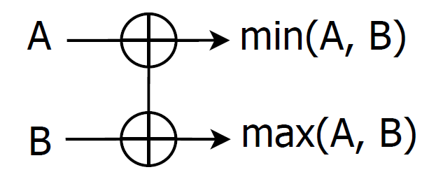
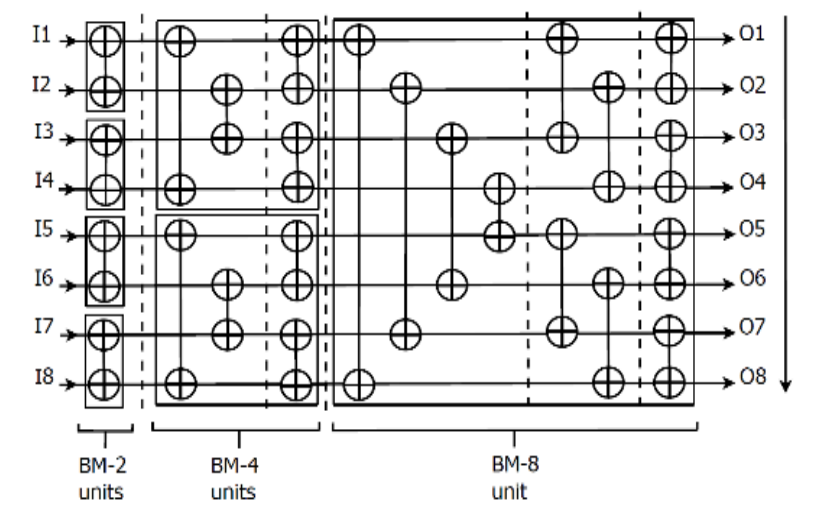
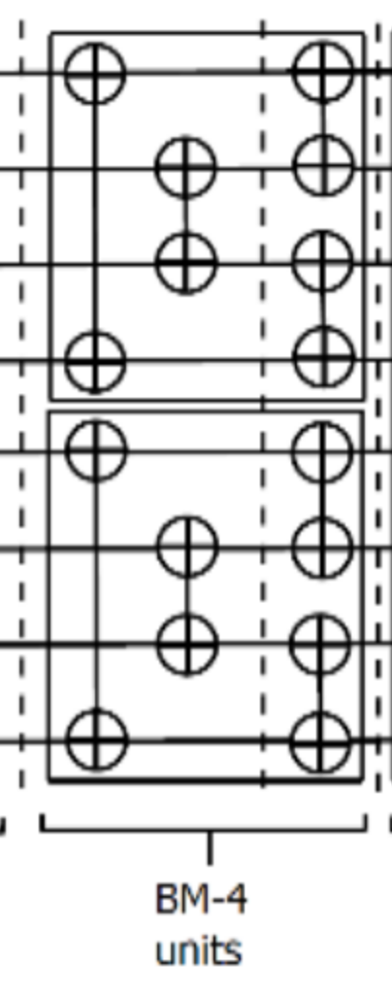
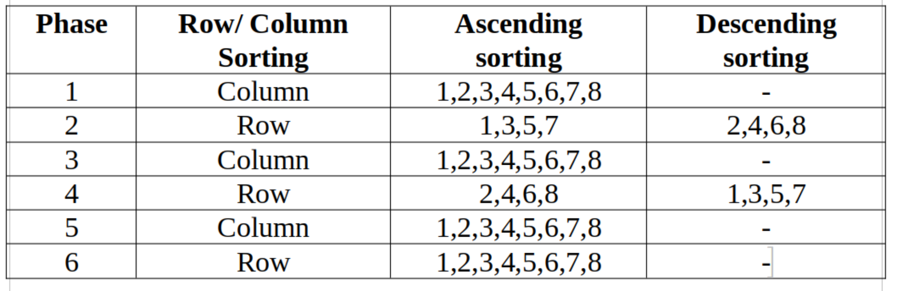
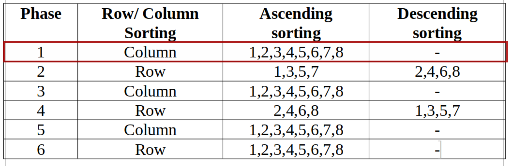
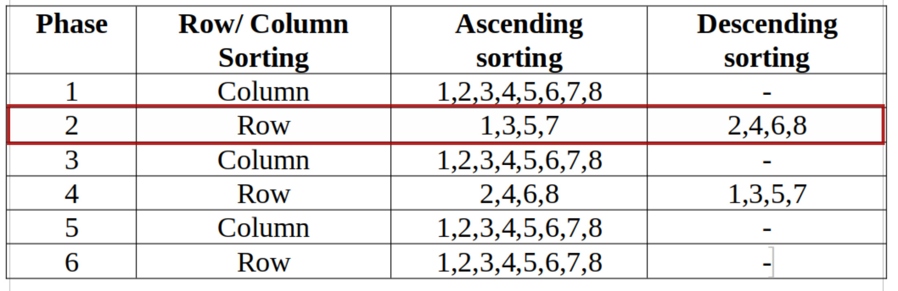

= Why I rewrote my capstone project in Bluespec SystemVerilog

mailto:sai.govardhan@incoresemi.com[Govardhan] | 
 4th January, 2025

[.lead]
ifdef::backend-html5[]
++++
<style>
h1, h2, h3, h4, h5, h6, .title, div.title {
    color: blue;
    font-weight: bold;
}

 .imageblock .title, .literalblock .title {
    color: blue;
 }
/* Control overall font size */
body {
    font-size: 14px;
    line-height: 1.5;
}

/* Adjust heading sizes */
title { font-size: 2em; }
h1 { font-size: 2em; }
h2 { font-size: 1.5em; }
h3 { font-size: 1.2em; }
h4 { font-size: 1.1em; }
h5, h6 { font-size: 1em; }

/* Adjust code block size */
pre, code {
    font-size: 13px;
}

/* Adjust paragraph and list text */
p, ul, ol, dl {
    font-size: 14px;
    line-height: 1.5;
}

/* Make figure captions smaller */
div.title, .imageblock .title, .literalblock .title {
    font-size: 1em;  /* Same as body text */
    margin-top: 0.5em;
    margin-bottom: 1em;
}
</style>
++++
endif::[]

== Introduction

This document outlines the motivation for using Bluespec SystemVerilog, which
provides high levels of abstraction to rapidly design hardware microarchitecture.

Like most undergraduate students, I started out designing initial digital
logic in Verilog, with reference to coding guidelines from professors, 
coursework, and the link:http://www.sunburst-design.com/papers/[sunburst papers].
Back then, specifying designs dealing with parallelism and concurrency was always a 
challenge due to lower levels of abstraction and regular rework to fix
synthesis-simulation mismatches. 
 
At link:https://incoresemi.com/[InCore], the use of BSV is one of the 
superpowers that enables small teams like ours to specify complex 
hardware intuitively, correctly, and efficiently. 

A year ago, as a novice BSV designer, I decided it would be interesting
and meaningful to contrast the efforts that my team and I spent during our 
capstone project by re-implementing the Multi-Dimensional Sorting Algorithm (MDSA) 
in a High-Level HDL - BSV. 
As an outcome, this blog collates these insights to establish a strong case for teaching
and using BSV at universities.

In this post, I shall be diving into my BSV implementation by explaining 
essential parts of the microarchitecture, the ease of specifying them in BSV, 
and corresponding snippets from the codebase.

More of our work on the taxonomy of sorters, low power methodologies, 
other variants (Hybrid and Odd-Even sorters), and our ASIC implementation results
can be referred to in our published paper 
link:https://ieeexplore.ieee.org/document/10234758[Low Power Multidimensional Sorters using Clock Gating and Index Sorting]. 

My complete MDSA Bitonic Implementation in BSV, along with our legacy 
Verilog implementation, can be found in my 
link:https://github.com/govardhnn/Low_Power_Multidimensional_Sorters[GitHub repository].

== The Compare And Exchange Block

The `Compare And Exchange` (CAE) block is a fundamental building block of Systolic 
Array based Parallel Hardware Sorters which sorts two inputs to an ascending order output.



- Specify the CAE typedef as a Vector of 2 elements of width `WordLength`:

[source,BSV]
include::../bsv/MDSA_bitonic/mdsa_types.bsv[lines=9..9]

- Declare the method ActionValue `mav_get_sort`:

The CAE block checks if `cae_in[0]` is greater than `cae_in[1]` to swap them.

TIP: We can use the inbuilt Vector to Vector `reverse` function to swap the values.  

[source,BSV]
include::../bsv/MDSA_bitonic/cae.bsv[lines=38..43]


== The Bitonic Sorting Unit

The Bitonic Sorting Unit is a network of 24 such CAE blocks, intricately 
arranged as depicted below. 



This network sorts eight input elements in ascending order at the end of 
six stages.

To read more about the Bitonic Sorting Network, refer to the seminal paper 
on systolic array sorting network design by Batcher[4].

If you look closely, we can take parts of
the above BM8 architecture and modularize them. 

=== The BM4 sorter

We could modularize a part of this design, the BM4 unit,
by creating an intermediate two-stage, four-input sorter,
and specify the two methods for input and output as follows:



- Declare a typedef for `BM4` as a vector of 4 inputs of width `WordLength`:

[source,BSV]
include::../bsv/MDSA_bitonic/mdsa_types.bsv[lines=11]

- Specify the intermediate pipeline as a register of the BM4 type:

[source,BSV]
include::../bsv/MDSA_bitonic/bm4.bsv[lines=59]

- First stage of sorting with the inputs, by routing the inputs at indices
0 and 3 to CAE-0, and 1 and 2 to CAE-1 block. 

TIP: We use the inbuilt vector function
`vec` to combine multiple elements into a vector:

[source,BSV]
include::../bsv/MDSA_bitonic/bm4.bsv[lines=68..71]

- Perform the second stage sorting with the intermediate sorted values by routing the pipeline outputs at indices
0 and 1 to CAE-0, and 2 and 3 to CAE-1 block:

[source,BSV]
include::../bsv/MDSA_bitonic/bm4.bsv[lines=79..80]

- Return the outputs as:

[source,BSV]
include::../bsv/MDSA_bitonic/bm4.bsv[lines=83..83]

=== The BM8 sorter

Now with the abstraction of using a BM4 sorter, we can proceed to design the
complete Bitonic Merge 8 input sorter as follows:

- Instantiate the 5 intermediate register pipelines:

[source,BSV]
include::../bsv/MDSA_bitonic/bm8.bsv[lines=45..45]

- Pass the inputs through the sorting network defined for each stage of the BM8, 
while storing the intermediate values in the above pipeline registers:

- Stage 1:

[source,BSV]
include::../bsv/MDSA_bitonic/bm8.bsv[lines=124..139]

- Stage 2:

Pass the outputs of the first stage to the BM4 sorter, and register their output
for the third stage:

[source,BSV]
include::../bsv/MDSA_bitonic/bm8.bsv[lines=55..56]

[source,BSV]
include::../bsv/MDSA_bitonic/bm8.bsv[lines=64..71]

\... and so on for the remaining stages 4 to 6.

=== The MDSA Algorithm Implementation

The MDSA algorithm efficiently uses Parallel Hardware Sorters (PHSAs) like the Bitonic sorter we earlier designed to specify an architecture that uses eight such units 
to sort 64 elements in 6 stages by only alternating between row and column sorting, and rerouting the order of outputs (ascending/descending).

Also, now that we are redesigning the MDSA, I desire to implement an optimization where I handle the ascending and descending order of the MDSA inputs at the 
input of the Parallel Sorting Networks and limit myself to use unidirectional CAE blocks.


In the legacy verilog implementation, we had CAE blocks that could support both the directions, and kept the top level simple such that we only transpose between row and column sorting between phases.

IMPORTANT: The reason why I choose to keep the CAEs simple is because selecting between the ascending
and descending increases the number of multiplexors in each CAE block, 
and in the MDSA sorter,
there are 8 (Bitonic Networks) * 24 (CAE blocks in each Network) = 192 CAE blocks which is indeed substantial! 
Let us later look at the gate-count difference to determine how much this optimization has impacted 
our implementation's area :)

image::./img/MDSA.png[width=50%,title="The block diagram of the MDSA Architecture"]

==== MDSA Agorithm FSM



We specify the `MDSA_64` type which is a multidimensional 8x8 vector 

[source,BSV]
include::../bsv/MDSA_bitonic/mdsa_types.bsv[lines=17..18]


To create a 64 record register buffer specified as:

[source,BSV]
include::../bsv/MDSA_bitonic/mdsa_bitonic.bsv[lines=35]

And use this helper function to send inputs to the MDSA sorter network:

[source,BSV]
include::../bsv/MDSA_bitonic/mdsa_bitonic.bsv[lines=15..27]

==== Stage 1: Column Sorting 

- Sending the inputs to the Eight BM8 sorters:



[source,BSV]
include::../bsv/MDSA_bitonic/mdsa_bitonic.bsv[lines=40..46]

- Collecting the ascending order of responses

[source,BSV]
include::../bsv/MDSA_bitonic/mdsa_bitonic.bsv[lines=52..59]

- Transposing the output: 

TIP: We can use the inbuilt Vector to Vector `transpose` function
in BSV to alternate between the row and column sorting between the phases of the MDSA.

[source,BSV]
include::../bsv/MDSA_bitonic/mdsa_bitonic.bsv[lines=63]

==== Stage 2: Row Sorting 

- Sending the inputs to the Eight BM8 sorters:



[source,BSV]
include::../bsv/MDSA_bitonic/mdsa_bitonic.bsv[lines=71..77]

- Collecting the alternating ascending and descending order of responses

[source,BSV]
include::../bsv/MDSA_bitonic/mdsa_bitonic.bsv[lines=84..95]

- Transposing the output

[source,BSV]
include::../bsv/MDSA_bitonic/mdsa_bitonic.bsv[lines=98]

\... and so on for the remaining stages 3 to 6 as per the MDSA Algorithm FSM.

Ultimately, an ideal test case where all 64 inputs specified in descending order:

```
[MDSA] STARTING MDSA STAGE 1
[MDSA]: STAGE 1 INPUTS:<V <V 'h00000040 'h0000003f 'h0000003e 'h0000003d 'h0000003c 'h0000003b 'h0000003a 'h00000039  > <V 'h00000038 'h00000037 'h00000036 'h00000035 'h00000034 'h00000033 'h00000032 'h00000031  > <V 'h00000030 'h0000002f 'h0000002e 'h0000002d 'h0000002c 'h0000002b 'h0000002a 'h00000029  > <V 'h00000028 'h00000027 'h00000026 'h00000025 'h00000024 'h00000023 'h00000022 'h00000021  > <V 'h00000020 'h0000001f 'h0000001e 'h0000001d 'h0000001c 'h0000001b 'h0000001a 'h00000019  > <V 'h00000018 'h00000017 'h00000016 'h00000015 'h00000014 'h00000013 'h00000012 'h00000011  > <V 'h00000010 'h0000000f 'h0000000e 'h0000000d 'h0000000c 'h0000000b 'h0000000a 'h00000009  > <V 'h00000008 'h00000007 'h00000006 'h00000005 'h00000004 'h00000003 'h00000002 'h00000001  >  >
```

Shall be sorted in 6 stages to ascending order as follows:

```
Final MDSA output: <%h><V <V 'h00000001 'h00000002 'h00000003 'h00000004 'h00000009 'h0000000a 'h0000000b 'h0000000c  > <V 'h00000005 'h00000006 'h00000007 'h00000008 'h0000000d 'h0000000e 'h0000000f 'h00000010  > <V 'h00000011 'h00000012 'h00000013 'h00000014 'h00000019 'h0000001a 'h0000001b 'h0000001c  > <V 'h00000015 'h00000016 'h00000017 'h00000018 'h0000001d 'h0000001e 'h0000001f 'h00000020  > <V 'h00000021 'h00000022 'h00000023 'h00000024 'h00000029 'h0000002a 'h0000002b 'h0000002c  > <V 'h00000025 'h00000026 'h00000027 'h00000028 'h0000002d 'h0000002e 'h0000002f 'h00000030  > <V 'h00000031 'h00000032 'h00000033 'h00000034 'h00000039 'h0000003a 'h0000003b 'h0000003c  > <V 'h00000035 'h00000036 'h00000037 'h00000038 'h0000003d 'h0000003e 'h0000003f 'h00000040  >  >
Verilog simulation finished
```


=== Steps to run simulations of the CAE, BM4, BM8 and MDSA_Bitonic in the GitHub Repository

. Clone the repository:

    git clone https://github.com/govardhnn/Low_Power_Multidimensional_Sorters.git

. Navigate the the build directory of the BSV collateral

    cd bsv/build

. Modify the `makefile.inc` to select the module to simulate

For CAE/BM4/BM8/MDSA:

    TB_BSV:= cae_testbench / bm4_testbench / bm8_testbench / mdsa_bitonic_testbench

. To run the simulation with the Bluespec Compiler (bsc):
    
    make all_vsim

The generated verilog can be found in the `verilog_dir` directory

NOTE: To get a vcd dump of the simulation, rerun the executable with the +bscvcd argument.
Eg.  ./mk_mdsa_bitonic_testbench_vsim +bscvcd
Or, add the +bscvcd flag to the `v_simulate` target in the Makefile

=== Observations

. Number of lines of code

In the BSV implementation of the MDSA

     46 cae.bsv
     87 bm4.bsv
    153 bm8.bsv
    246 mdsa_bitonic.bsv

Which generates the following verilog modules

    66  mk_cae.v
    171 mk_bm4.v
    575 mk_bm8.v
    829 mk_mdsa_bitonic.v 

TIP: You can disable the $display statements from being generated in the verilog generation phase by removing the define `-D DISPLAY` in the Makefile

=== Finally, the Gate-Count Comparison of the legacy Verilog MDSA vs the new BSV MDSA implementations 

NOTE: We shall be using the open-source synthesis tool link:https://github.com/YosysHQ/yosys[Yosys], and the scripts can be found in `bsv/build/synth.ys` and `verilog/MDSA_bitonic/synth.ys`

==== Legacy Verilog MDSA synthesis

To run synth of the legacy Verilog MDSA codebase with top module `MDSA_top`:

    cd verilog/MDSA_bitonic

and run:

    yosys -s synth.ys

And we shall find that the synthesis gate count is:

    Number of wires:             143051
    Number of wire bits:         247433
    Number of public wires:        1674
    Number of public wire bits:   56173
    Number of memories:               0
    Number of memory bits:            0
    Number of processes:              0
    Number of cells:             121574

==== BSV MDSA synthesis

NOTE: We shall be running synthesis on the
verilog generated from the BSV explained in this blog. 

You can run a yosys synth at the bsv/build with top module `mk_mdsa_bitonic`

    make yosys_synth

And the synthesis gate count is:

    Number of wires:             108735
    Number of wire bits:         243796
    Number of public wires:        2576
    Number of public wire bits:  101182
    Number of memories:               0
    Number of memory bits:            0
    Number of processes:              0
    Number of cells:              90410


_There you go! A reduction in gate-count from *121k* to *90k*._ A staggering *25%* reduction in thet total number of cells.

=== Scope of future contribution to this project

- Implementing the Hybrid and Odd Even Sorter designs in BSV - which is pretty fun and replicable looking at the current BSV implementation of the Bitonic Sorter

- Deep-dive into the logic that changed between the legacy Verilog MDSA and the 
new BSV redesign of the MSDA

- Implement Index Sorting for the Sorting Networks in BSV similiar to the legacy Verilog implementation.

- Attach this sorting unit to a CPU and implement the MDSA as a co-processor. Find sorter efficiency for relevant workloads. 

=== Acknowledgements(TODO)

<reviewers, thanks>

The block diagrams and drawings to aid the explanation of the CAE, Bitonic and MDSA are from the paper[1], and the legacy Verilog codebase from the team Samahith S A, Manogna R, Hitesh D guided by my UG Professor Dr. Sudeendra Kumar at PES University, Bangalore.

Initial Work on MDSA [5] and PHSA sorter variants[6]

The BSV languare compiler [2] and libraries reference guide from Bluespec(inc)

=== References

. link:https://ieeexplore.ieee.org/document/10234758["Low Power Multidimensional Sorters using Clock Gating and Index Sorting." 2023 IEEE International Conference on Electronics, Computing and Communication Technologies (CONECCT)]
. link:https://github.com/B-Lang-org/bsc[The Bluespec Compiler(bsc)]
. link:https://github.com/B-Lang-org/bsc?tab=readme-ov-file#documentation["Bluespec Libraries Reference Guide"]
.  link:https://www.cs.kent.edu/~batcher/sort.pdf["Sorting Networks and Their Applications,” Proc. AFIPS Proc. Spring Joint Computer Conf., 1968.]
. link:https://sdprosolutions.com/files/base-papers/2019/vlsi/vlsi-18.pdf["RTHS: A Low-Cost High-Performance Real-Time Hardware Sorter, Using a Multidimensional Sorting Algorithm" in IEEE Transactions on Very Large-Scale Integration (VLSI) Systems, July 2019.]
. link:https://dl.acm.org/doi/10.1007/978-3-031-58502-9_7["Design of Hybrid Sorting Unit," 2019 International Conference on Smart Structures and Systems (ICSSS), Chennai, India, 2019]
