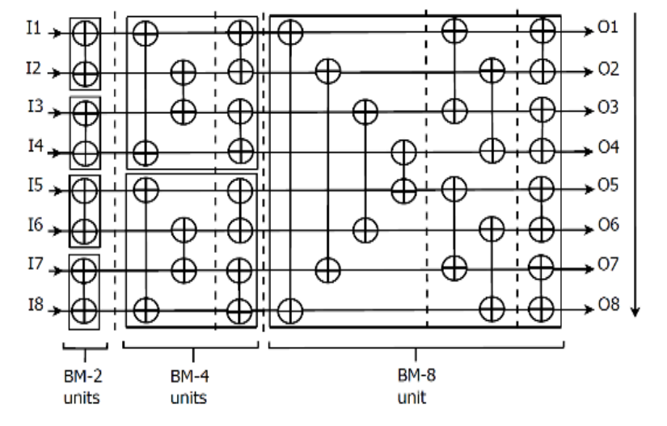

=== Why I rewrote my capstone project in BSV

Author: Sai Govardhan M C +
Email: sai.govardhan@incoresemi.com

== Introduction

This document outlines the motivation to using Bluespec System Verilog which
provides high levels of abstraction to rapidly design hardware microarchitecture.

As it happens with most Electronics students, I started out designing digital design logic, 
in Verilog, with reference to coding guidelines from the link:http://www.sunburst-design.com/papers/[Sunburst Papers] and careful guidance from my UG professor and course textbooks. 

Specifying designs with parallelism and concurrency in Verilog was always a 
challenge due to lower levels of abstraction and regular rework to fix synthesis-simulation mismatches.

At InCore, the use of BSV is one of the superpowers that enabled a small teams like us to specify 
complex hardware intuitively, correctly and efficiently. 

During my internship at InCore in 2024, as a novice BSV designer, I decided it 
would be meaningful to contrast the efforts that my team and I
spent at college implementing the Multi Dimensional Sorting Algorithm(MDSA) in Verilog - by rewriting the MDSA Bitonic variant in BSV. This blog collates these insights, to establish a strong use-case of BSV at universities.

I shall be diving into the BSV implementation by explaining essential parts of 
the micro-architecture, and corresponding snippets from the code base.

More of our work on the taxonomy of sorters, low power methodologies, 
other variants (Hybrid and Odd-Even sorters) and our ASIC implementation results
can be referred to in our published paper link:https://ieeexplore.ieee.org/document/10234758[Low Power Multidimensional Sorters using Clock Gating and Index Sorting]. 

My complete MDSA Bitonic Implementation in BSV, along with our legacy Verilog implementation can be found in my link:https://github.com/govardhnn/Low_Power_Multidimensional_Sorters[GitHub repository].

== The Compare And Exchange Block

The Compare And Exchange (CAE) block is a fundamental building block of systolic 
array based hardware sorters. It simply compares two inputs and presents an 
ascending order output. 

image::CAE.png[]
_The CAE Block_

- Specify the CAE typedef as a Vector of 2 elements:

[source,BSV]
include::../bsv/MDSA_bitonic/mdsa_types.bsv[lines=8..9]


- Declare the method ActionValue 'mav_get_sort':

The CAE block checks if cae_in[0] is greated that cae_in[1] and uses the Vector 
to Vector `reverse` function to swap the values.  

[source,BSV]
include::../bsv/MDSA_bitonic/cae.bsv[lines=38..43]


== The Bitonic Sorting Unit

The Bitonic Sorting Unit is a network of 24 such CAE blocks, arranged as depicted 
below. This network sorts 8 input elements in ascending order at the end of sig stages.


_The Bitonic Sorting Network_

=== The BM4 sorter
We could very easily modularize this design by creating an intermediate BM4 unit 
as a two stage - four input sorter, from the above diagram, and specify the two methods
for input and output as follows:

- We specify the intermediate pipeline as:

[source,BSV]
include::../bsv/MDSA_bitonic/bm4.bsv[lines=59]

- Perform the first stage sorting with the inputs, by routing the inputs at index
0 and 3 to the CAE-0, and 1 and 2 to CAE-1 block:

[source,BSV]
include::../bsv/MDSA_bitonic/bm4.bsv[lines=68..71]

- Perform the second stage sorting with the intermediate sorted values by routing the pipeline outputs at index
0 and 1 to the CAE-0, and 2 and 3 to CAE-1 block:

[source,BSV]
include::../bsv/MDSA_bitonic/bm4.bsv[lines=79..80]

- And return the outputs as:

[source,BSV]
include::../bsv/MDSA_bitonic/bm4.bsv[lines=83..83]

=== The BM8 sorter

Now with the abstraction of using a BM4 sorter, we can proceed to design the
 complete Bitonic Merge 8 sorter as follows:

- Instantiate the 5 intermediate registers pipelines:

[source,BSV]
include::../bsv/MDSA_bitonic/bm8.bsv[lines=54..54]

- Pass the inputs the the sorter and pass them through the network defined
for each stage, while storing the intermediate values in the pipeline registers:

- Stage 1:

[source,BSV]
include::../bsv/MDSA_bitonic/bm8.bsv[lines=127..139]

- Stage 2:

Pass the outputs of the first stage to the BM4 sorter:

[source,BSV]
include::../bsv/MDSA_bitonic/bm8.bsv[lines=55..56]

Register the outputs of the BM4 sorters for the third stage:

[source,BSV]
include::../bsv/MDSA_bitonic/bm8.bsv[lines=65..71]

\... and so on for the remaining stages.

== The MDSA Algorithm Implementation

The MDSA algorithm stands out in its use of Parallel Hardware Sorters(PHSAs) like the Bitonic sorter we earlier designed to specify an architecture that uses 8 such units to sort 64 elements in 6 stages by alternating between row and column sorting, and rerouting the order of outputs(ascending/descending).

image::MDSA.png[]
_The block diagram of the MDSA Architecture_


_The FSM that implements the MDS-Algorithm_

We specify the MDSA_64 type

[source,BSV]
include::../bsv/MDSA_bitonic/mdsa_types.bsv[lines=17..18]

To create a 64 record register buffer specified as:
[source,BSV]
include::../bsv/MDSA_bitonic/mdsa_bitonic.bsv[lines=34]

And use this helper function to send inputs to the MDSA sorter network:

[source,BSV]
include::../bsv/MDSA_bitonic/mdsa_bitonic.bsv[lines=15..27]

To create the 
Stage 1: Column Sorting 

- Sending the inputs to the Eight BM8 sorters:

[source,BSV]
include::../bsv/MDSA_bitonic/mdsa_bitonic.bsv[lines=40..46]

- Collecting the ascending order of responses

[source,BSV]
include::../bsv/MDSA_bitonic/mdsa_bitonic.bsv[lines=52..59]


Transposing the output
[source,BSV]
include::../bsv/MDSA_bitonic/mdsa_bitonic.bsv[lines=62]

Stage 2: Row Sorting 

- Sending the inputs to the Eight BM8 sorters:

[source,BSV]
include::../bsv/MDSA_bitonic/mdsa_bitonic.bsv[lines=71..77]

- Collecting the alternating ascending and descending order of responses

[source,BSV]
include::../bsv/MDSA_bitonic/mdsa_bitonic.bsv[lines=84..95]

Transposing the output
[source,BSV]
include::../bsv/MDSA_bitonic/mdsa_bitonic.bsv[lines=98]

/... and so on for the remaining stages.

Ultimately, an ideal 64 numbers all in descending order sent as input:

```
[MDSA] STARTING MDSA STAGE 1
[MDSA]: STAGE 1 INPUTS:<V <V 'h00000040 'h0000003f 'h0000003e 'h0000003d 'h0000003c 'h0000003b 'h0000003a 'h00000039  > <V 'h00000038 'h00000037 'h00000036 'h00000035 'h00000034 'h00000033 'h00000032 'h00000031  > <V 'h00000030 'h0000002f 'h0000002e 'h0000002d 'h0000002c 'h0000002b 'h0000002a 'h00000029  > <V 'h00000028 'h00000027 'h00000026 'h00000025 'h00000024 'h00000023 'h00000022 'h00000021  > <V 'h00000020 'h0000001f 'h0000001e 'h0000001d 'h0000001c 'h0000001b 'h0000001a 'h00000019  > <V 'h00000018 'h00000017 'h00000016 'h00000015 'h00000014 'h00000013 'h00000012 'h00000011  > <V 'h00000010 'h0000000f 'h0000000e 'h0000000d 'h0000000c 'h0000000b 'h0000000a 'h00000009  > <V 'h00000008 'h00000007 'h00000006 'h00000005 'h00000004 'h00000003 'h00000002 'h00000001  >  >
```

Shall be sorted in 6 stages to:

```
Final MDSA output: <%h><V <V 'h00000001 'h00000002 'h00000003 'h00000004 'h00000009 'h0000000a 'h0000000b 'h0000000c  > <V 'h00000005 'h00000006 'h00000007 'h00000008 'h0000000d 'h0000000e 'h0000000f 'h00000010  > <V 'h00000011 'h00000012 'h00000013 'h00000014 'h00000019 'h0000001a 'h0000001b 'h0000001c  > <V 'h00000015 'h00000016 'h00000017 'h00000018 'h0000001d 'h0000001e 'h0000001f 'h00000020  > <V 'h00000021 'h00000022 'h00000023 'h00000024 'h00000029 'h0000002a 'h0000002b 'h0000002c  > <V 'h00000025 'h00000026 'h00000027 'h00000028 'h0000002d 'h0000002e 'h0000002f 'h00000030  > <V 'h00000031 'h00000032 'h00000033 'h00000034 'h00000039 'h0000003a 'h0000003b 'h0000003c  > <V 'h00000035 'h00000036 'h00000037 'h00000038 'h0000003d 'h0000003e 'h0000003f 'h00000040  >  >
Verilog simulation finished
```

== References

// 1
// 2
// 3
// 4
// 5
// 6
// 7
// 8


== Acknowledgements

// The block diagrams and drawings to aid the explaination of the CAE, Bitonic and MDSA are from the paper[1], and the legacy Verilog codebase from the team (names) guided by my UG Professor -(name) at PES Universtiy, Bangalore.  

// The BSV language [] [] compiler and training material

// Initial Work on MDSA and its predecessors[][].

// Much thanks to my manager (name) and peers (names) for reviewing the blogpost and InCore for permitting to write on this topic.


